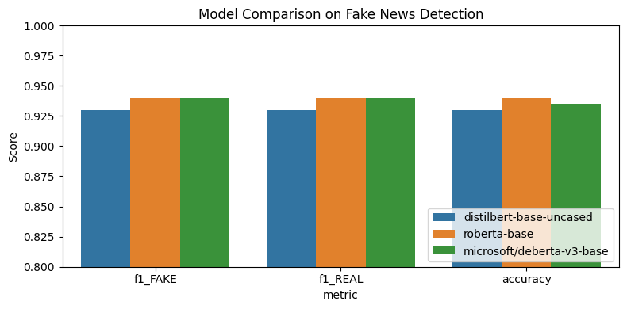

# Fake News Classifier

A demonstration of fine-tuning modern Transformer models (DistilBERT, RoBERTa, DeBERTa) for binary fake-vs-real news classification, complete with data processing, baseline models, advanced evaluation, SHAP explainability, and hyperparameter tuning.

---

## 📖 Table of Contents

1. [Project Overview](#project-overview)
2. [Motivation](#motivation)
3. [Repository Structure](#repository-structure)
4. [Getting Started](#getting-started)

   * [Prerequisites](#prerequisites)
   * [Installation](#installation)
5. [Data Preparation & EDA](#data-preparation--eda)
6. [Baseline Models](#baseline-models)
7. [Fine-Tuning Transformers](#fine-tuning-transformers)
8. [Evaluation & Results](#evaluation--results)

   * [Accuracy & F1 Comparison](#accuracy--f1-comparison)
   * [Confusion Matrices](#confusion-matrices)
9. [Error Analysis](#error-analysis)
10. [Model Explainability (SHAP)](#model-explainability-shap)
11. [Hyperparameter Tuning](#hyperparameter-tuning)
12. [License](#license)

---

## 📝 Project Overview

We build a fake-news detector by fine-tuning three Transformer‐based models on a combined dataset of political claims. Our goals:

* **Data integration & cleaning** of multiple fake‐news sources (BuzzFeed, PolitiFact, LIAR, ISOT).
* **Baseline**: TF-IDF + classical ML classifiers (Logistic Regression, Random Forest).
* **Advanced**: Fine-tune DistilBERT, RoBERTa, and DeBERTa for superior performance.
* **Evaluation**: Compare accuracy, F1 scores, confusion matrices.
* **Explainability**: Use SHAP to interpret model decisions.
* **Hyperparameter tuning**: Grid search over learning rates, batch sizes, epochs.

---

## 🎯 Motivation

Fake news poses a threat to public discourse and democratic processes. Accurate automated detection can:

* Assist fact‐checking organizations.
* Highlight misleading claims on social media.
* Provide researchers with explainable AI tools.

By working end‐to‐end—from raw data to interpretable models—this project demonstrates both engineering and research-oriented skills.

---

## 🚀 Getting Started

### Prerequisites

* Python 3.8+
* Git
* (Optional) GPU with CUDA for faster training

### Installation

1. **Clone the repo**

   ```bash
   git clone https://github.com/AhireRohit/fake-news-classifier.git
   cd fake-news-classifier
   ```

2. **Create & activate a virtual environment**

   ```bash
   python3 -m venv venv
   source venv/bin/activate
   ```

3. **Install dependencies**

   ```bash
   pip install -r requirements.txt
   ```

---

## 🔍 Data Preparation & EDA

1. **Merge raw sources** in `data/raw/` (BuzzFeed, PolitiFact, LIAR, ISOT).
2. **Clean** (lowercase, remove URLs, punctuation).
3. **Generate** `data/processed/all_cleaned_news.csv`.
4. **Visualize** label balance, text‐length distributions, and source‐wise splits in `01_eda.ipynb`.

---

## 🏞 Baseline Models

* **TF-IDF** vectorization (`max_features=5k`, `ngram_range=(1,2)`).
* **Classical classifiers**:

  * Logistic Regression (⟶ ≈ 91 % accuracy, F1 ≈ 0.92)
  * Random Forest (⟶ ≈ 92 % accuracy, F1 ≈ 0.92)
* Results & confusion matrices in `02_baseline_models.ipynb`.

---

## ⚙️ Fine-Tuning Transformers

We fine-tune three architectures:

| Model                     | Params  | Train Time (CPU) | Accuracy | F1-score |
| ------------------------- | ------- | ---------------- | -------- | -------- |
| DistilBERT (base-uncased) | \~66 M  | \~10 min/epoch   | 0.93     | 0.93     |
| RoBERTa (base)            | \~125 M | \~30 min/epoch   | 0.94     | 0.94     |
| DeBERTa-v3 (base)         | \~140 M | \~40 min/epoch   | 0.935    | 0.935    |

See `03_fine_tune.ipynb` for code:

1. Tokenize (max\_length = 100, dynamic padding).
2. DataCollator for batching.
3. `TrainingArguments` with step-based eval & checkpointing.
4. Save two best checkpoints per model.
5. Evaluate & compare.

---

## 📊 Evaluation & Results

### Accuracy & F1 Comparison

```python
import pandas as pd
import seaborn as sns
import matplotlib.pyplot as plt

df = pd.DataFrame(results)  # See notebook for `results` definition
melted = df.melt(
    id_vars="model",
    value_vars=["accuracy","f1_FAKE","f1_REAL"],
    var_name="metric",
    value_name="score"
)
plt.figure(figsize=(8,4))
sns.barplot(data=melted, x="metric", y="score", hue="model")
plt.ylim(0.80,1.00)
plt.title("Model Comparison: Accuracy & F1 Scores")
plt.show()
```

<details>
<summary><em>Click to see sample plot</em></summary>



</details>

---

## 🕵️ Error Analysis

We list top **false positives** (model says REAL but label = FAKE) to identify recurring patterns:

```python
fp_ix = np.where((preds_distil==1)&(labels_distil==0))[0]
for i in fp_ix[:5]:
    print("TEXT:", test_df.iloc[i]["text"])
    print("PRED:", preds_distil[i], "TRUE:", labels_distil[i], "\n---")
```

---

## 🔍 Model Explainability with SHAP

Using the Partition explainer on DistilBERT:

```python
import shap

# wrap model+tokenizer into a function f(...)
# build masker = shap.maskers.Text(tokenizer)
explainer = shap.Explainer(f, masker, output_names=["FAKE","REAL"])
texts = ["The governor signed a new law today."]
sv = explainer(texts)[0]
shap.plots.text(sv)
```

</details>

**Interpretation**:

* Tokens pushing toward **FAKE** are highlighted in red; toward **REAL** in blue.
* SHAP base value shows the model’s prior.

---

## ⚙️ Hyperparameter Tuning

Grid search over:

```python
import itertools
import pandas as pd

lrs       = [1e-5, 2e-5, 3e-5]
batch_ls  = [16, 32]
epoch_ls  = [2, 3]
records   = []

for lr, bs, epochs in itertools.product(lrs, batch_ls, epoch_ls):
    # re-init Trainer with these args…
    # trainer.train(); metrics = trainer.evaluate()
    records.append({"lr":lr,"bs":bs,"epochs":epochs,
                    "f1":metrics["eval_f1"],
                    "accuracy":metrics["eval_accuracy"]})

df_hp = pd.DataFrame(records).sort_values("f1",ascending=False)
print(df_hp.to_markdown(index=False))
```

## 📄 License

This project is licensed under the MIT License. See [LICENSE](LICENSE) for details.

---

*Happy fact-checking!*
